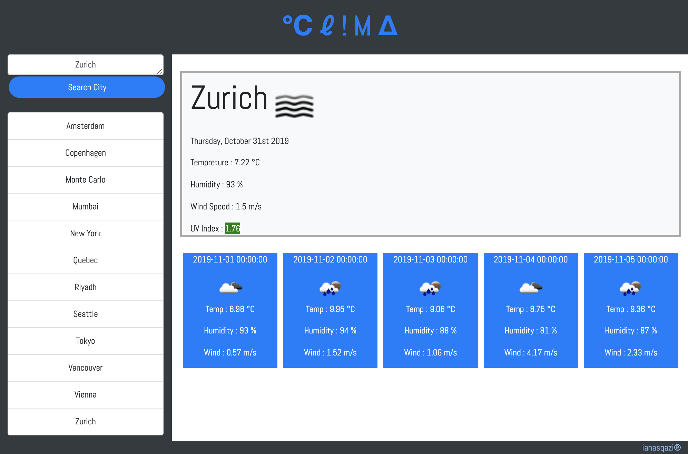

# CLIMA : Weather-App
A Weather Application using free Weather API from openweatherapp.org. Access current weather data for any location on Earth including over 200,000 cities!

## Assignment 6 : UofT Cooding Bootcamp

The assignment focusses on using APIS to make multiple AJAX calls and revieve the response in JSON format.
The response will be updated in the elements on the page created dynamically with jQuery and display the weather forcast.

Click to check out : https://ianasqazi.github.io/Weather-App/

## Screenshots 

### API's Used 

* OpenWeatherMap - Current Weather
* OpenWeatherMap - UV Index
* OpenWeatherMap - Forcast

## Languages Used 

* HTML 
* CSS
* Javascript

## Libraries used 

* Bootstrap
* jQuery
* Moment.js
* Google Fonts
